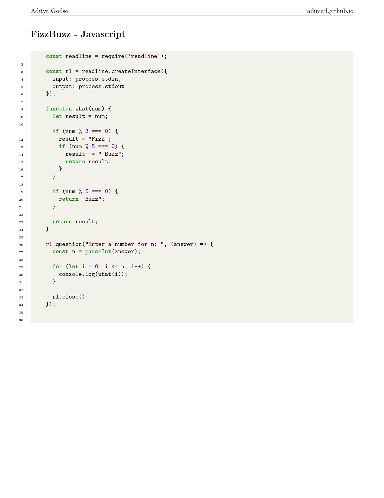
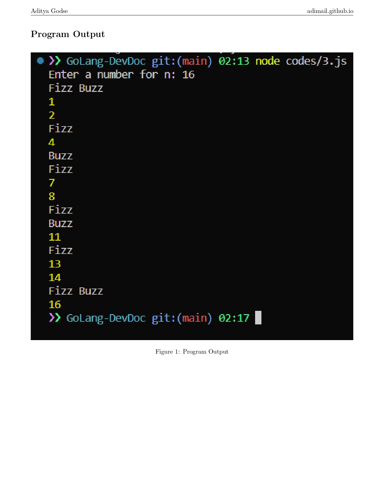
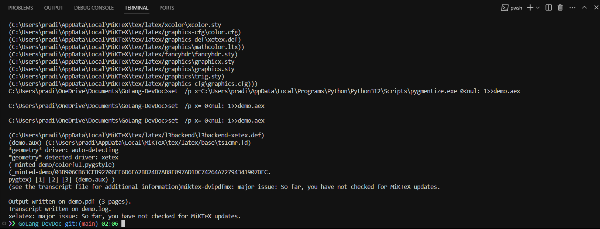

  <a href="https://adimail.github.io/">
    <picture>
      
    </picture>
    <h1 align="center">DevDoc</h1>
  </a>

code-to-PDF conversion tool powered by Golang and LaTeX to transform source code from various programming languages into polished and professional-looking PDF documents.

LaTeX is a typesetting system commonly used for the production of scientific and mathematical documents due to its excellent support for complex formulas and structures. It is based on the TeX typesetting language and is widely used for creating documents like research papers, articles, and technical reports. LaTeX provides a high level of control over document formatting and is particularly favored in academic and technical circles for its precision and professional output.

> I only wrote this as a typing practice hehe..
>
> > Also I wanted to test my monkey brain
> >
> > > It works fine

## Little preview

### Under development and less active (repo)

### Current problems:

- cant pack all dependencies (xelatex, minktex) into a single binary executable
- using LaTex as a template fo pass strings and image paths as environment inputs to generate pdf's
- Adding logic to latex docs

Fork this if you have any solutions.

### Personal Learnings:

- Docker
- LaTex engine
- Go
- et al.
